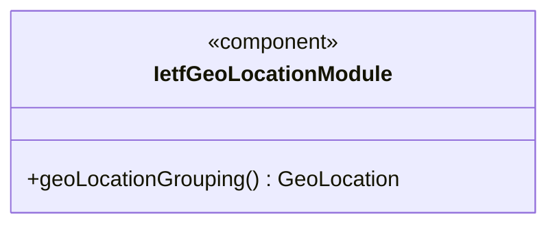
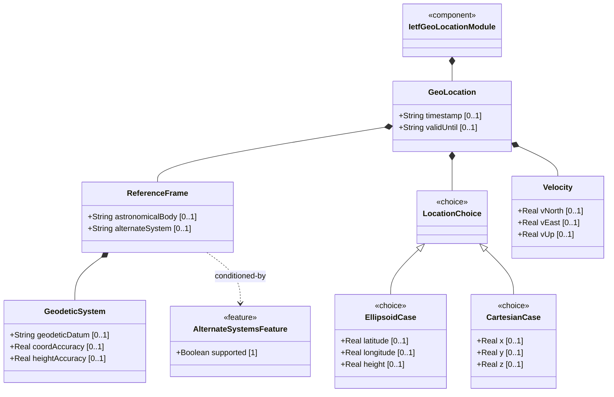
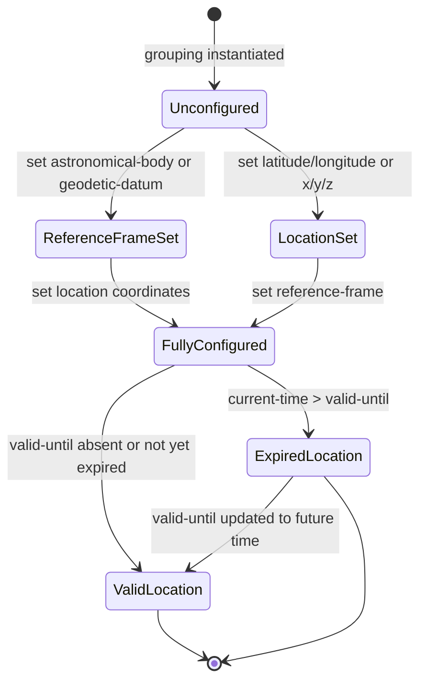

# Epic: Geographic Location: YANG Geo-Location Grouping

## 1. Context

This Epic covers the complete specification engineering of the `ietf-geo-location` YANG module defined in RFC 9179. The module provides a generic, reusable `geo-location` YANG grouping for specifying a location on or in reference to any astronomical body. It supports ellipsoidal and Cartesian coordinate systems, velocity vectors for objects in motion, temporal recording and validity expiration, and an optional alternate-systems feature for non-natural-universe reference frames (e.g., virtual realities).

The grouping is designed for use in other YANG data models — it does not define a root data node itself but exports a `geo-location` container grouping that any YANG module may embed via `uses geo:geo-location`.

## 2. Requirements & Checklist

- [ ] #1 - [Specify Reference Frame for Geographic Location](https://github.com/gintatkinson/dep-tst-devn-01/blob/main/docs/features/feat-01-reference-frame.md) (defines the astronomical body, alternate-system feature, and coordinate interpretation context)
- [ ] #2 - [Define Geodetic System and Coordinate Accuracy](https://github.com/gintatkinson/dep-tst-devn-01/blob/main/docs/features/feat-02-geodetic-system.md) (defines geodetic datum and optional coordinate/height accuracy overrides within the reference frame)
- [ ] #3 - [Record Ellipsoidal Coordinates for Geographic Location](https://github.com/gintatkinson/dep-tst-devn-01/blob/main/docs/features/feat-03-ellipsoidal-coordinates.md) (latitude/longitude/height as the ellipsoid case of the location choice)
- [ ] #4 - [Record Cartesian Coordinates for Geographic Location](https://github.com/gintatkinson/dep-tst-devn-01/blob/main/docs/features/feat-04-cartesian-coordinates.md) (x/y/z as the Cartesian case of the location choice, mutually exclusive with ellipsoid)
- [ ] #5 - [Capture Velocity Vector for Objects in Motion](https://github.com/gintatkinson/dep-tst-devn-01/blob/main/docs/features/feat-05-velocity-vector.md) (v-north/v-east/v-up velocity components for stable motion with speed/heading derivation formulas)
- [ ] #6 - [Track Location Timestamp and Validity Expiration](https://github.com/gintatkinson/dep-tst-devn-01/blob/main/docs/features/feat-06-timestamp-validity.md) (timestamp of recording and optional valid-until expiration for location data currency)

### Associated Use Cases & User Stories

#### Associated Use Cases
- [ ] #12 - [Record and Query a Geographic Location](https://github.com/gintatkinson/dep-tst-devn-01/blob/main/docs/use-cases/uc-01-record-query-location.md) (core system interaction for storing and retrieving geo-location data)
- [ ] #13 - [Track a Moving Object's Location and Velocity Over Time](https://github.com/gintatkinson/dep-tst-devn-01/blob/main/docs/use-cases/uc-02-track-moving-object.md) (motion tracking via velocity vector, timestamp, and valid-until)
- [ ] #14 - [Configure Location for Non-Earth or Alternate-System Deployment](https://github.com/gintatkinson/dep-tst-devn-01/blob/main/docs/use-cases/uc-03-non-earth-alternate-system.md) (non-Earth astronomical body and alternate-systems feature configuration)

#### Associated User Stories
- [ ] #8 - [Derive 2D Speed and Heading from Velocity Vector](https://github.com/gintatkinson/dep-tst-devn-01/blob/main/docs/user-stories/us-01-derive-speed-heading.md) (algorithmic derivation of speed and heading from v-north and v-east)
- [ ] #9 - [Handle Location Data Validity Expiration](https://github.com/gintatkinson/dep-tst-devn-01/blob/main/docs/user-stories/us-02-location-validity-expiration.md) (temporal lifecycle: valid-until expiration and data currency)
- [ ] #10 - [Inherit Reference Frame in Nested Location Contexts](https://github.com/gintatkinson/dep-tst-devn-01/blob/main/docs/user-stories/us-03-nested-location-inheritance.md) (nested location reference-frame inheritance pattern)
- [ ] #11 - [Specify Geographic Location on Non-Earth Astronomical Body](https://github.com/gintatkinson/dep-tst-devn-01/blob/main/docs/user-stories/us-04-non-earth-location.md) (non-Earth body location configuration with appropriate geodetic datum)

## 3. Architecture and System Interaction Diagrams

### Subsystem Component Definition

### System-Level UML Class Diagram

## 4. State Machine Definitions

### System State Machine Diagram

## 5. Specification Context

> "This module defines a grouping of a container object for specifying a location on or around an astronomical object (e.g., 'earth')."
>
> "This document defines a generic geographical location YANG grouping. The geographical location grouping is intended to be used in YANG data models for specifying a location on or in reference to Earth or any other astronomical object."
>
> — RFC 9179, Abstract and Module Description

## 6. Source References
Structural Schema: [ietf-geo-location@2022-02-11.yang](https://raw.githubusercontent.com/YangModels/yang/main/standard/ietf/RFC/ietf-geo-location%402022-02-11.yang)
Normative Specification: [RFC 9179 — A YANG Grouping for Geographic Locations](https://www.rfc-editor.org/rfc/rfc9179.html)
