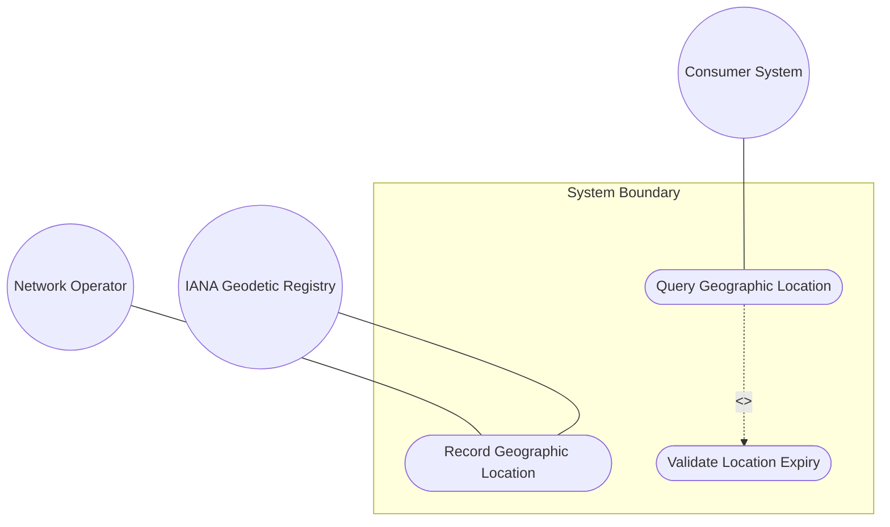
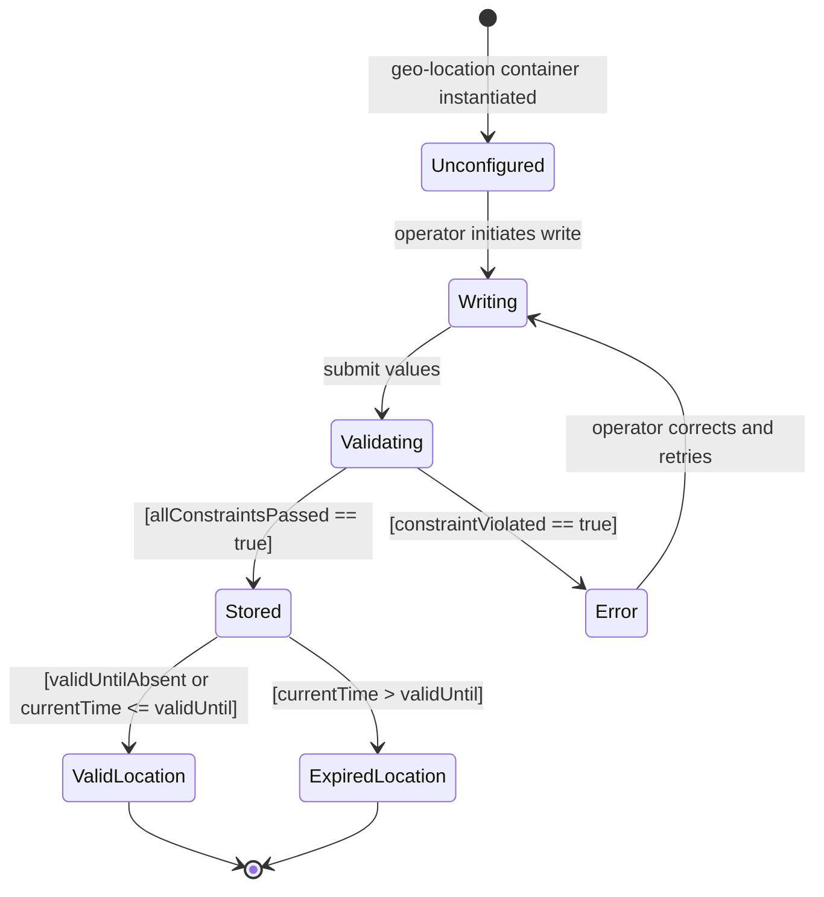

# Use Case: Record and Query a Geographic Location

## Parent Epic
- [ ] #7 - Geographic Location: YANG Geo-Location Grouping (https://github.com/gintatkinson/dep-tst-devn-01/blob/main/docs/epics/epic-01-geo-location.md) (core system interaction for storing and retrieving location data via the geo-location grouping)

## 1. Actors
- **Primary Actor:** Network Operator (human or management system writing location data via NETCONF/RESTCONF)
- **Secondary Actors:** Consumer System (reads location data), IANA Geodetic Registry (reference for datum validation)

## 2. Preconditions
- A YANG data model using the `geo-location` grouping is deployed and accessible via NETCONF or RESTCONF
- The target device or data store supports the `ietf-geo-location` module
- The operator has write access to the geo-location container

## 3. Trigger
The network operator initiates a write operation to set the location of a managed object (e.g., a network device, rack, fiber endpoint).

## 4. Main Success Scenario (Basic Flow)
1. The operator sets `astronomical-body` to `"earth"` (or relies on the default) in `reference-frame`
2. The operator sets `geodetic-datum` to `"wgs-84"` in `geodetic-system` (or relies on the default)
3. The operator writes `latitude` and `longitude` values (decimal degrees) and optionally `height` (meters)
4. The operator optionally sets `timestamp` to the current time of recording
5. The operator optionally sets `valid-until` to indicate when this location data expires
6. The system validates all values against schema constraints (type, pattern, choice exclusivity)
7. The system stores the geo-location data
8. A consumer queries the geo-location container and receives the stored values
9. The consumer reads `valid-until`; if current time ≤ `valid-until` (or `valid-until` is absent), the location is considered valid

## 5. Alternate and Exception Flows

- **5a. Choice conflict — ellipsoid and Cartesian both provided (Branches from Basic Flow step 3):**
  1. The operator provides both `latitude` and `x` in the same write operation
  2. The system detects the YANG choice constraint violation and rejects the operation with a constraint error; no data is stored

- **5b. Pattern violation on astronomical-body (Branches from Basic Flow step 1):**
  1. The operator sets `astronomical-body` to a value containing control characters outside ASCII 32–64, 91–126
  2. The system rejects the value with a pattern constraint violation; the write operation fails

- **5c. Location data is expired at query time (Branches from Basic Flow step 9):**
  1. The consumer reads the geo-location data and compares current time to `valid-until`
  2. Current time exceeds `valid-until`; the consumer treats the location as expired and SHOULD NOT use it for real-time decisions
  3. The consumer may trigger a refresh request to the operator

- **5d. No location coordinates set (Branches from Basic Flow step 3):**
  1. The operator writes only `reference-frame` values without any location coordinates
  2. The system accepts the partial configuration (location choice is optional); the consumer receives reference-frame data without coordinates

## 6. Postconditions (Guarantees)
- **Success Guarantee:** The geo-location container is stored with valid, schema-compliant values; the consumer can read them; `valid-until` correctly governs data currency
- **Failure Guarantee:** On constraint violation, no partial data is written; the system returns a specific error identifying the violated constraint; the prior state (if any) is preserved

## UML Diagrams

### Use Case Diagram

### State Machine Diagram

## 7. Operational Context

> "In many applications, we would like to specify the location of something geographically. Some examples of locations in networking might be the location of data centers, a rack in an Internet exchange point, a router, a firewall, a port on some device, or it could be the endpoints of a fiber, or perhaps the failure point along a fiber."
>
> — RFC 9179, Section 1

## 8. Realization Matrix

### Required User Stories
- [ ] #9 - [Handle Location Data Validity Expiration](https://github.com/gintatkinson/dep-tst-devn-01/blob/main/docs/user-stories/us-02-location-validity-expiration.md) (valid-until expiry check is an integral step in querying location data)
- [ ] #10 - [Inherit Reference Frame in Nested Location Contexts](https://github.com/gintatkinson/dep-tst-devn-01/blob/main/docs/user-stories/us-03-nested-location-inheritance.md) (reference frame optionality governs what gets written and queried at each nesting level)

### Required Features
- [ ] #1 - [Specify Reference Frame for Geographic Location](https://github.com/gintatkinson/dep-tst-devn-01/blob/main/docs/features/feat-01-reference-frame.md) (reference-frame is configured in step 1–2 of the main flow)
- [ ] #2 - [Define Geodetic System and Coordinate Accuracy](https://github.com/gintatkinson/dep-tst-devn-01/blob/main/docs/features/feat-02-geodetic-system.md) (geodetic-datum provides the coordinate interpretation context)
- [ ] #3 - [Record Ellipsoidal Coordinates for Geographic Location](https://github.com/gintatkinson/dep-tst-devn-01/blob/main/docs/features/feat-03-ellipsoidal-coordinates.md) (latitude/longitude/height are the primary values written and queried)
- [ ] #6 - [Track Location Timestamp and Validity Expiration](https://github.com/gintatkinson/dep-tst-devn-01/blob/main/docs/features/feat-06-timestamp-validity.md) (timestamp and valid-until govern the temporal context of the stored location)

## Source References
Structural Schema: [ietf-geo-location@2022-02-11.yang](https://raw.githubusercontent.com/YangModels/yang/main/standard/ietf/RFC/ietf-geo-location%402022-02-11.yang)
Normative Specification: [RFC 9179 — A YANG Grouping for Geographic Locations](https://www.rfc-editor.org/rfc/rfc9179.html)
