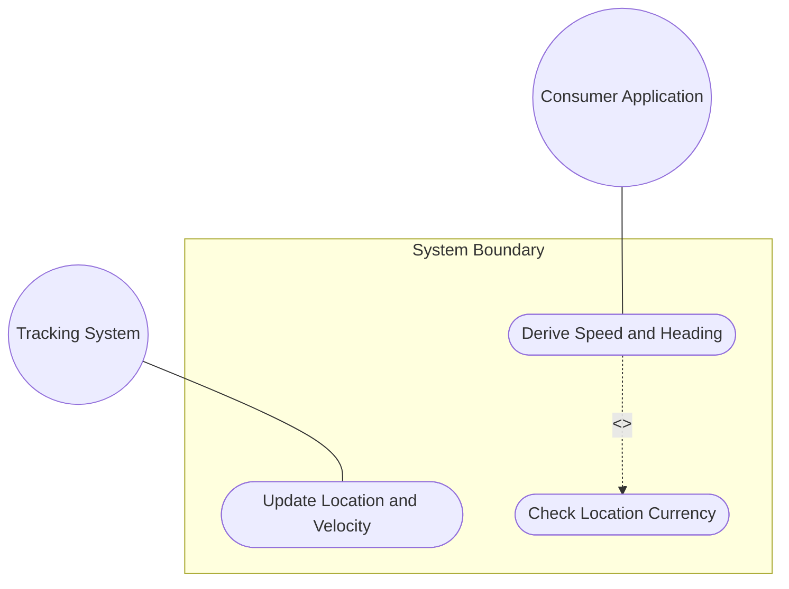
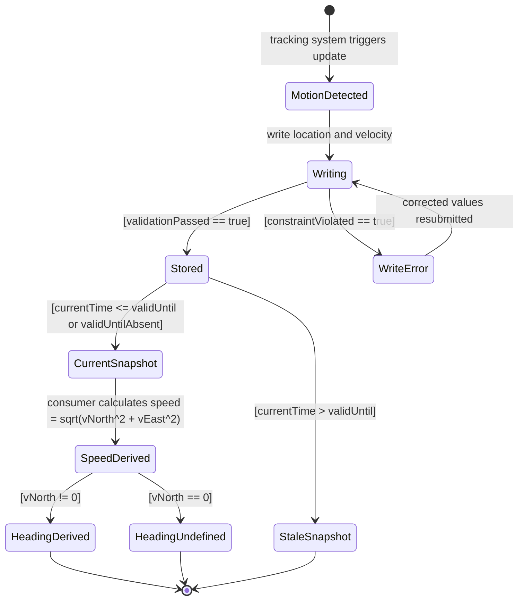

# Use Case: Track a Moving Object's Location and Velocity Over Time

## Parent Epic
- [ ] #7 - Geographic Location: YANG Geo-Location Grouping (https://github.com/gintatkinson/dep-tst-devn-01/blob/main/docs/epics/epic-01-geo-location.md) (parent grouping that provides the velocity container and timestamp for motion tracking)

## 1. Actors
- **Primary Actor:** Tracking System (automated system periodically updating location and velocity data)
- **Secondary Actors:** Consumer Application (reads motion data to derive speed/heading)

## 2. Preconditions
- A YANG data model using the `geo-location` grouping is deployed for a moveable object
- The object is in relatively stable motion (e.g., experiencing continental drift, slow geophysical movement, or steady-state travel)
- The tracking system has write access to update the geo-location container

## 3. Trigger
The tracking system detects a location update is due (either by schedule or by detecting motion beyond a threshold) and initiates a write operation to update location, velocity, and timestamp.

## 4. Main Success Scenario (Basic Flow)
1. The tracking system writes updated `latitude` and `longitude` (or `x`, `y`, `z`) values reflecting the object's current position
2. The tracking system writes `v-north`, `v-east`, and `v-up` values in the `velocity` container in meters per second
3. The tracking system writes `timestamp` to the current time of the location/velocity measurement
4. The tracking system optionally writes `valid-until` to indicate when this snapshot expires
5. The system validates and stores the updated geo-location data
6. The consumer reads the geo-location container
7. The consumer uses `v-north` and `v-east` to derive 2D speed: `speed = √(v_north² + v_east²)`
8. The consumer uses `v-north` and `v-east` to derive heading: `heading = arctan(v_east / v_north)`
9. The consumer checks `valid-until` or `timestamp` age to confirm the data is current

## 5. Alternate and Exception Flows

- **5a. Velocity absent — stationary snapshot (Branches from Basic Flow step 2):**
  1. The tracking system does not write velocity values (object is momentarily stationary or velocity is unknown)
  2. The system stores the location without velocity; speed and heading cannot be derived
  3. The consumer treats the object as having no known motion vector

- **5b. Heading undefined — v-north is zero (Branches from Basic Flow step 8):**
  1. The consumer calculates `heading = arctan(v_east / v_north)` where `v-north = 0`
  2. Division by zero results in an undefined heading
  3. The consumer handles the undefined heading case (object is moving purely east/west or is stationary)

- **5c. Location snapshot is stale (Branches from Basic Flow step 9):**
  1. The consumer checks `valid-until` and finds current time exceeds it
  2. The consumer marks the location as expired; the velocity vector may no longer reflect actual motion
  3. The consumer requests a fresh update from the tracking system

- **5d. Complex motion — grouping insufficient (Branches from Basic Flow step 2):**
  1. The tracking system detects the object is changing velocity rapidly (non-stable motion)
  2. The geo-location grouping is insufficient for this use case (RFC 9179 scope limitation)
  3. The tracking system either increases update frequency or augments the YANG model with additional motion data

## 6. Postconditions (Guarantees)
- **Success Guarantee:** The geo-location container holds the latest position, velocity vector, and timestamp; consumers can derive 2D speed and heading; `valid-until` governs data currency
- **Failure Guarantee:** On validation failure, no partial update is stored; the previous valid snapshot remains accessible; the tracking system receives a specific constraint error

## UML Diagrams

### Use Case Diagram

### State Machine Diagram

## 7. Operational Context

> "Support is added for objects in relatively stable motion. For objects in relatively stable motion, the grouping provides a three-dimensional vector value... For some applications that demand high accuracy and where the data is infrequently updated, this velocity vector can track very slow movement such as continental drift. Tracking more complex forms of motion is outside the scope of this work."
>
> — RFC 9179, Section 2.3

## 8. Realization Matrix

### Required User Stories
- [ ] #8 - [Derive 2D Speed and Heading from Velocity Vector](https://github.com/gintatkinson/dep-tst-devn-01/blob/main/docs/user-stories/us-01-derive-speed-heading.md) (speed/heading derivation is steps 7–8 of the main flow)
- [ ] #9 - [Handle Location Data Validity Expiration](https://github.com/gintatkinson/dep-tst-devn-01/blob/main/docs/user-stories/us-02-location-validity-expiration.md) (valid-until expiry governs whether the motion snapshot is current)

### Required Features
- [ ] #5 - [Capture Velocity Vector for Objects in Motion](https://github.com/gintatkinson/dep-tst-devn-01/blob/main/docs/features/feat-05-velocity-vector.md) (v-north, v-east, v-up are the core velocity values written and derived from)
- [ ] #3 - [Record Ellipsoidal Coordinates for Geographic Location](https://github.com/gintatkinson/dep-tst-devn-01/blob/main/docs/features/feat-03-ellipsoidal-coordinates.md) (latitude/longitude are the position values updated with each tracking cycle)
- [ ] #6 - [Track Location Timestamp and Validity Expiration](https://github.com/gintatkinson/dep-tst-devn-01/blob/main/docs/features/feat-06-timestamp-validity.md) (timestamp anchors the velocity vector to a specific moment in time; valid-until controls snapshot currency)

## Source References
Structural Schema: [ietf-geo-location@2022-02-11.yang](https://raw.githubusercontent.com/YangModels/yang/main/standard/ietf/RFC/ietf-geo-location%402022-02-11.yang)
Normative Specification: [RFC 9179 — A YANG Grouping for Geographic Locations](https://www.rfc-editor.org/rfc/rfc9179.html)
