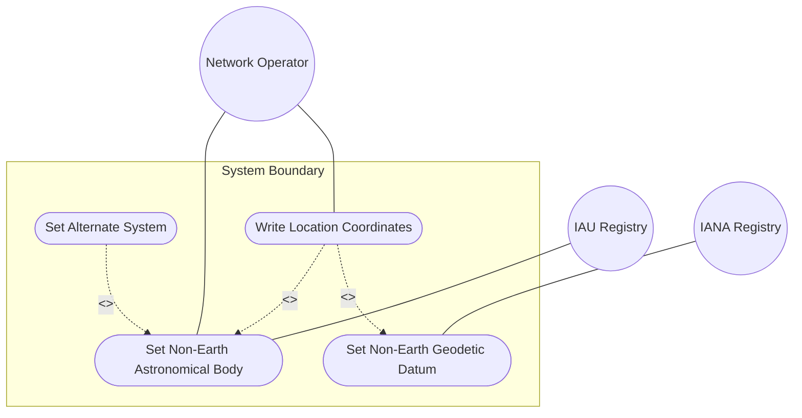
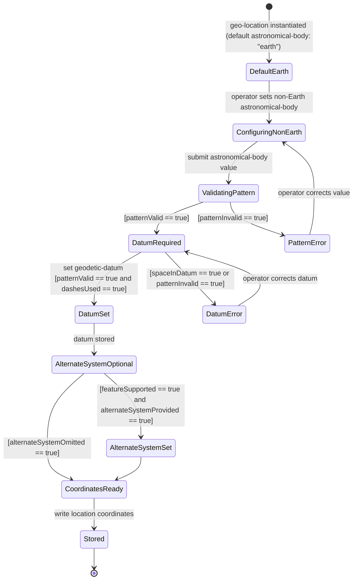

# Use Case: Configure Location for Non-Earth or Alternate-System Deployment

## Parent Epic
- [ ] #7 - Geographic Location: YANG Geo-Location Grouping (https://github.com/gintatkinson/dep-tst-devn-01/blob/main/docs/epics/epic-01-geo-location.md) (parent grouping that supports non-Earth astronomical bodies and alternate systems via reference-frame)

## 1. Actors
- **Primary Actor:** Network Operator (configures location for devices on non-Earth bodies or in alternate systems)
- **Secondary Actors:** IAU Astronomical Registry (authoritative source for astronomical body names), IANA Geodetic Registry (authoritative source for geodetic datum values)

## 2. Preconditions
- A YANG data model using the `geo-location` grouping is deployed for a device or object located on a non-Earth body or within an alternate coordinate system (e.g., simulation or virtual reality)
- If `alternate-system` is to be used, the target device MUST support the `alternate-systems` YANG feature
- The operator has write access to the geo-location container

## 3. Trigger
The network operator initiates configuration of a geo-location instance for an object whose location cannot be described using default Earth/WGS-84 values — either because the object is on another astronomical body or because it exists within an alternate coordinate system.

## 4. Main Success Scenario (Basic Flow)
1. The operator sets `astronomical-body` to the target body name (e.g., `"moon"`, `"mars"`, `"enceladus"`) using an IAU-recognised name in lowercase ASCII
2. The operator sets `geodetic-datum` to the appropriate non-Earth datum (e.g., `"me"` for Mean Earth/Polar Axis on the Moon) from the IANA Geodetic System Values registry
3. The operator optionally sets `alternate-system` (if the device supports the `alternate-systems` feature) to specify a virtual or simulation system
4. The operator writes `latitude` and `longitude` (or `x`, `y`, `z`) coordinates interpreted relative to the configured datum
5. The system validates `astronomical-body` against the ASCII pattern constraint
6. The system validates `geodetic-datum` against the ASCII pattern constraint (spaces converted to dashes)
7. The system stores the complete reference frame and location data
8. A consumer reads the geo-location and correctly interprets all coordinate values relative to the non-Earth datum

## 5. Alternate and Exception Flows

- **5a. alternate-system provided but feature not supported (Branches from Basic Flow step 3):**
  1. The operator sets `alternate-system` on a device that does not support the `alternate-systems` YANG feature
  2. The system rejects the write with a feature-not-supported error
  3. The operator either targets a feature-capable device or omits `alternate-system`

- **5b. Invalid astronomical-body pattern (Branches from Basic Flow step 1):**
  1. The operator sets `astronomical-body` to a value with control characters or characters outside ASCII 32–64, 91–126
  2. The system rejects the value with a pattern constraint violation
  3. The operator corrects the value to use only valid ASCII characters in lowercase

- **5c. Unrecognised geodetic-datum value (Branches from Basic Flow step 2):**
  1. The operator sets `geodetic-datum` to a value not present in the IANA registry (e.g., a custom datum name)
  2. The schema does not enforce registry membership — the system accepts the value (no additional constraint in schema)
  3. Consumers that require registry-validated datums SHOULD validate independently

- **5d. Space in geodetic-datum value (Branches from Basic Flow step 2):**
  1. The operator sets `geodetic-datum` to `"mean earth"` (with a space)
  2. The system MUST reject or normalize the value to `"mean-earth"` (spaces converted to dashes per IANA registry rule)
  3. The operator corrects the value to use dashes

## 6. Postconditions (Guarantees)
- **Success Guarantee:** The geo-location container holds a fully configured non-Earth reference frame with valid astronomical body, geodetic datum, and coordinates; consumers can correctly interpret all location values relative to the non-Earth datum
- **Failure Guarantee:** On pattern or feature constraint violation, no data is stored; the prior configuration (if any) is preserved; the operator receives a specific error identifying the violated constraint

## UML Diagrams

### Use Case Diagram

### State Machine Diagram

## 7. Operational Context

> "Additionally, while this location is typically relative to Earth, it does not need to be. Indeed, it is easy to imagine a network or device located on the Moon, on Mars, on Enceladus (the moon of Saturn), or even on a comet (e.g., 67p/churyumov-gerasimenko). Finally, one can imagine defining locations using different frames of reference or even alternate systems (e.g., simulations or virtual realities)."
>
> "This optional feature adds an 'alternate-system' value to the reference frame. This value is normally not present, which implies the natural universe is the system. The use of this value is intended to allow for creating virtual realities or perhaps alternate coordinate systems."
>
> — RFC 9179, Sections 1 and 2.1

## 8. Realization Matrix

### Required User Stories
- [ ] #11 - [Specify Geographic Location on Non-Earth Astronomical Body](https://github.com/gintatkinson/dep-tst-devn-01/blob/main/docs/user-stories/us-04-non-earth-location.md) (directly models the operator workflow for non-Earth body configuration)

### Required Features
- [ ] #1 - [Specify Reference Frame for Geographic Location](https://github.com/gintatkinson/dep-tst-devn-01/blob/main/docs/features/feat-01-reference-frame.md) (astronomical-body and alternate-system are the primary values set in steps 1 and 3)
- [ ] #2 - [Define Geodetic System and Coordinate Accuracy](https://github.com/gintatkinson/dep-tst-devn-01/blob/main/docs/features/feat-02-geodetic-system.md) (geodetic-datum must be set to a non-Earth registry value in step 2)
- [ ] #3 - [Record Ellipsoidal Coordinates for Geographic Location](https://github.com/gintatkinson/dep-tst-devn-01/blob/main/docs/features/feat-03-ellipsoidal-coordinates.md) (latitude/longitude coordinates are written in step 4 relative to the non-Earth datum)
- [ ] #4 - [Record Cartesian Coordinates for Geographic Location](https://github.com/gintatkinson/dep-tst-devn-01/blob/main/docs/features/feat-04-cartesian-coordinates.md) (Cartesian x/y/z may alternatively be used in step 4 for non-Earth body coordinates)

## Source References
Structural Schema: [ietf-geo-location@2022-02-11.yang](https://raw.githubusercontent.com/YangModels/yang/main/standard/ietf/RFC/ietf-geo-location%402022-02-11.yang)
Normative Specification: [RFC 9179 — A YANG Grouping for Geographic Locations](https://www.rfc-editor.org/rfc/rfc9179.html)
