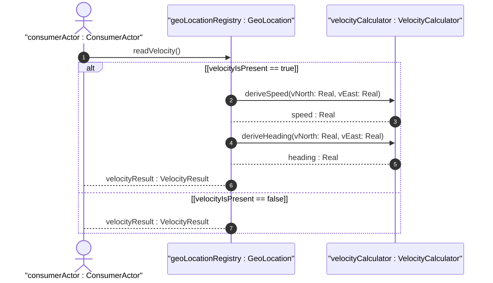
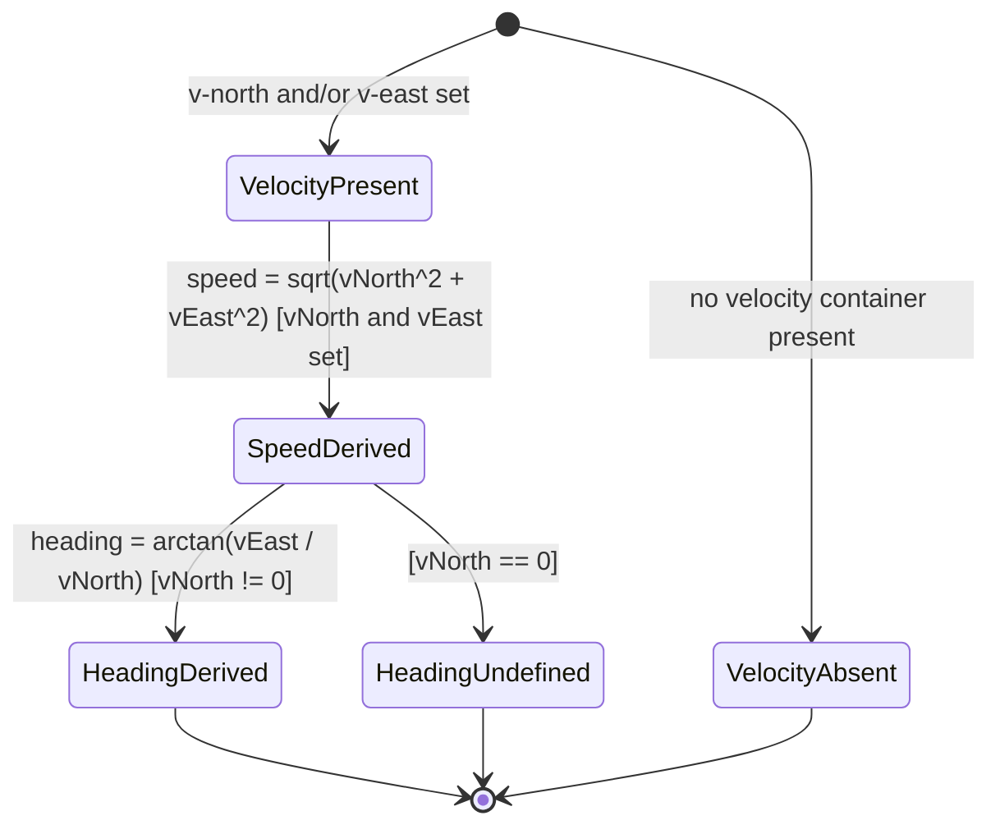

# User Story: Derive 2D Speed and Heading from Velocity Vector

## Parent Epic
- [ ] #7 - Geographic Location: YANG Geo-Location Grouping (https://github.com/gintatkinson/dep-tst-devn-01/blob/main/docs/epics/epic-01-geo-location.md) (parent grouping that defines the velocity vector from which speed and heading are derived)

## Domain Object Mapping
- **Primary Domain Objects:** `Velocity` (`v-north`, `v-east`, `v-up`)
- **Actor/Role:** Consumer system or application reading geo-location data

## BDD Scenario (OOA/OOD Realization)

**As a** consumer of geo-location data
**I want to** derive the two-dimensional speed and bearing heading of an object from its velocity vector
**So that** I can determine how fast an object is moving and in which direction without requiring separate speed/heading fields

## UML Sequence Diagram

## UML State Machine Diagram

## Operational Context

> "To derive the two-dimensional heading and speed, one would use the following formulas: speed = √(v_north² + v_east²), heading = arctan(v_east / v_north). For some applications that demand high accuracy and where the data is infrequently updated, this velocity vector can track very slow movement such as continental drift."
>
> — RFC 9179, Section 2.3

## Required Features Matrix
- [ ] #5 - [Capture Velocity Vector for Objects in Motion](https://github.com/gintatkinson/dep-tst-devn-01/blob/main/docs/features/feat-05-velocity-vector.md) (v-north and v-east are the direct inputs to speed and heading derivation formulas)
- [ ] #1 - [Specify Reference Frame for Geographic Location](https://github.com/gintatkinson/dep-tst-devn-01/blob/main/docs/features/feat-01-reference-frame.md) (v-north and v-east are defined relative to true north as per the geodetic-system in the reference frame)

## Source References
Structural Schema: [ietf-geo-location@2022-02-11.yang](https://raw.githubusercontent.com/YangModels/yang/main/standard/ietf/RFC/ietf-geo-location%402022-02-11.yang)
Normative Specification: [RFC 9179 — A YANG Grouping for Geographic Locations](https://www.rfc-editor.org/rfc/rfc9179.html)
