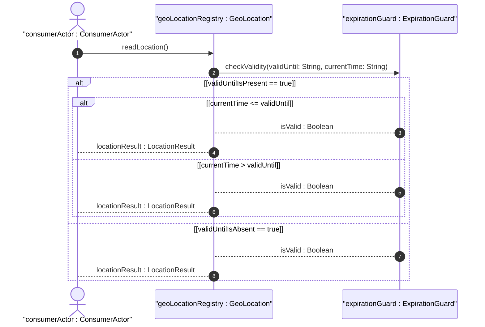
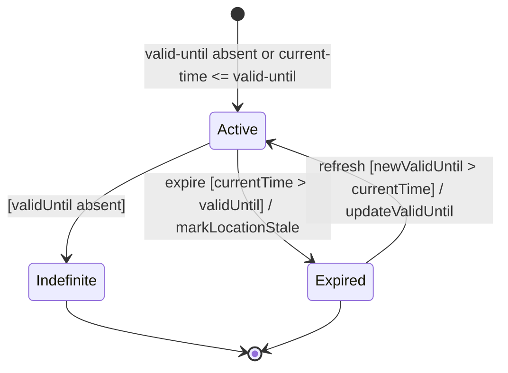

# User Story: Handle Location Data Validity Expiration

## Parent Epic
- [ ] #7 - Geographic Location: YANG Geo-Location Grouping (https://github.com/gintatkinson/dep-tst-devn-01/blob/main/docs/epics/epic-01-geo-location.md) (parent grouping that owns the valid-until lifecycle leaf)

## Domain Object Mapping
- **Primary Domain Objects:** `GeoLocation` (`valid-until`, `timestamp`)
- **Actor/Role:** Consumer system checking whether stored location data is still current

## BDD Scenario (OOA/OOD Realization)

**Given** a geo-location instance with a `valid-until` timestamp set to a future date
**When** the current system time advances past the `valid-until` value
**Then** the geo-location data is considered expired and the consumer SHOULD NOT use the location values for real-time decisions

## UML Sequence Diagram

## UML State Machine Diagram

## Operational Context

> "leaf valid-until { type yang:date-and-time; description \"The timestamp for which this geo-location is valid until. If unspecified, the geo-location has no specific expiration time.\"; }"
>
> — RFC 9179, Section 3 (YANG Module)

## Required Features Matrix
- [ ] #6 - [Track Location Timestamp and Validity Expiration](https://github.com/gintatkinson/dep-tst-devn-01/blob/main/docs/features/feat-06-timestamp-validity.md) (valid-until leaf directly governs the expiration lifecycle; timestamp provides the recording reference time)
- [ ] #3 - [Record Ellipsoidal Coordinates for Geographic Location](https://github.com/gintatkinson/dep-tst-devn-01/blob/main/docs/features/feat-03-ellipsoidal-coordinates.md) (ellipsoidal location values are the data subject to expiration)
- [ ] #4 - [Record Cartesian Coordinates for Geographic Location](https://github.com/gintatkinson/dep-tst-devn-01/blob/main/docs/features/feat-04-cartesian-coordinates.md) (Cartesian location values are also subject to the same expiration lifecycle)

## Source References
Structural Schema: [ietf-geo-location@2022-02-11.yang](https://raw.githubusercontent.com/YangModels/yang/main/standard/ietf/RFC/ietf-geo-location%402022-02-11.yang)
Normative Specification: [RFC 9179 — A YANG Grouping for Geographic Locations](https://www.rfc-editor.org/rfc/rfc9179.html)
