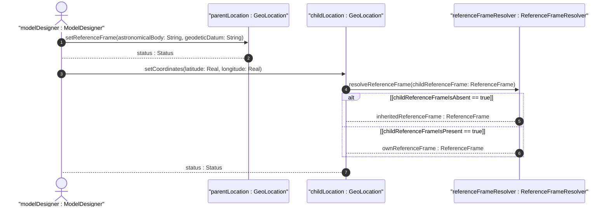
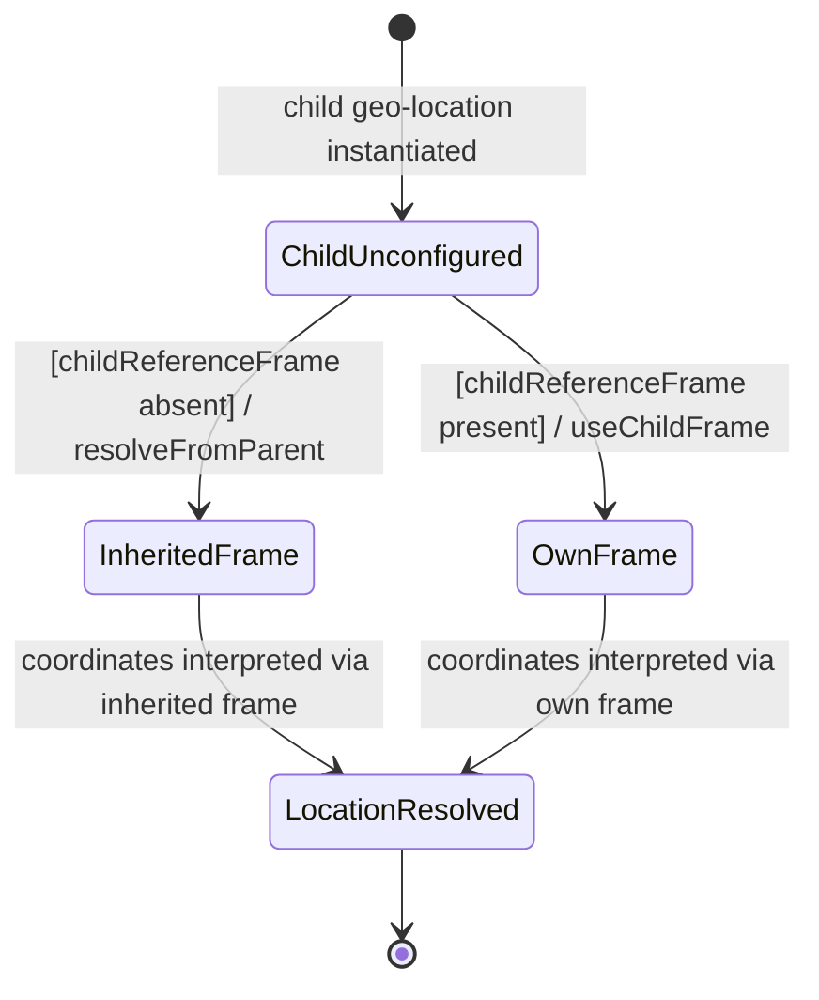

# User Story: Inherit Reference Frame in Nested Location Contexts

## Parent Epic
- [ ] #7 - Geographic Location: YANG Geo-Location Grouping (https://github.com/gintatkinson/dep-tst-devn-01/blob/main/docs/epics/epic-01-geo-location.md) (parent grouping that supports nested location use via the reference-frame inheritance pattern)

## Domain Object Mapping
- **Primary Domain Objects:** `GeoLocation`, `ReferenceFrame`
- **Actor/Role:** YANG data model designer embedding geo-location grouping in a hierarchy

## BDD Scenario (OOA/OOD Realization)

**As a** YANG data model designer
**I want to** allow child objects (e.g., routers inside a building) to inherit the reference frame from their containing parent object (e.g., the building)
**So that** the reference frame does not need to be repeated in every instance of nested location data

## UML Sequence Diagram

## UML State Machine Diagram

## Operational Context

> "When locations are nested (e.g., a building may have a location that houses routers that also have locations), the module using this grouping is free to indicate in its definition that the 'reference-frame' is inherited from the containing object so that the 'reference-frame' need not be repeated in every instance of location data."
>
> — RFC 9179, Section 2.4

## Required Features Matrix
- [ ] #1 - [Specify Reference Frame for Geographic Location](https://github.com/gintatkinson/dep-tst-devn-01/blob/main/docs/features/feat-01-reference-frame.md) (reference-frame is the entity being inherited; its optionality enables the inheritance pattern)
- [ ] #2 - [Define Geodetic System and Coordinate Accuracy](https://github.com/gintatkinson/dep-tst-devn-01/blob/main/docs/features/feat-02-geodetic-system.md) (geodetic-system within the reference-frame is the primary value inherited to avoid repetition)
- [ ] #3 - [Record Ellipsoidal Coordinates for Geographic Location](https://github.com/gintatkinson/dep-tst-devn-01/blob/main/docs/features/feat-03-ellipsoidal-coordinates.md) (the child's ellipsoidal coordinates are interpreted using the inherited reference frame)
- [ ] #4 - [Record Cartesian Coordinates for Geographic Location](https://github.com/gintatkinson/dep-tst-devn-01/blob/main/docs/features/feat-04-cartesian-coordinates.md) (the child's Cartesian coordinates are interpreted using the inherited reference frame)

## Source References
Structural Schema: [ietf-geo-location@2022-02-11.yang](https://raw.githubusercontent.com/YangModels/yang/main/standard/ietf/RFC/ietf-geo-location%402022-02-11.yang)
Normative Specification: [RFC 9179 — A YANG Grouping for Geographic Locations](https://www.rfc-editor.org/rfc/rfc9179.html)
