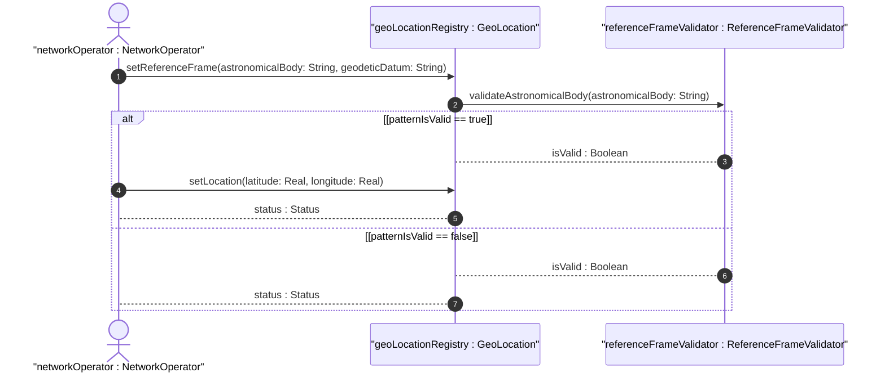
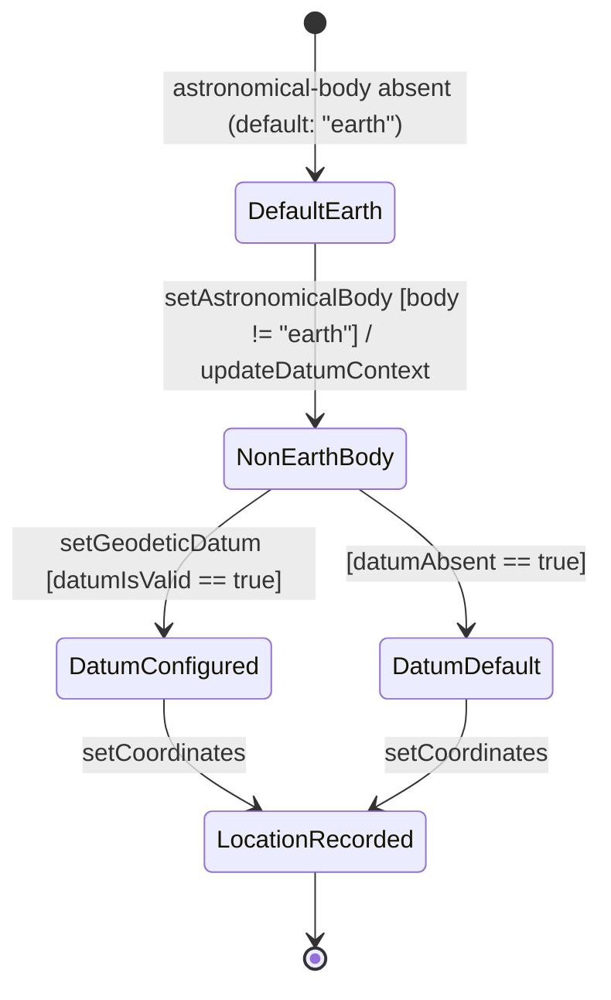

# User Story: Specify Geographic Location on Non-Earth Astronomical Body

## Parent Epic
- [ ] #7 - Geographic Location: YANG Geo-Location Grouping (https://github.com/gintatkinson/dep-tst-devn-01/blob/main/docs/epics/epic-01-geo-location.md) (parent grouping that supports non-Earth astronomical body specification via astronomical-body and geodetic-datum)

## Domain Object Mapping
- **Primary Domain Objects:** `ReferenceFrame` (`astronomical-body`, `geodetic-datum`), `GeoLocation` (`latitude`, `longitude`)
- **Actor/Role:** Network operator or data model consumer managing devices on non-Earth bodies

## BDD Scenario (OOA/OOD Realization)

**As a** network operator managing a device located on a non-Earth astronomical body
**I want to** specify the location using the appropriate astronomical body name and geodetic datum
**So that** the location coordinates are correctly interpreted relative to that body's coordinate system

## UML Sequence Diagram

## UML State Machine Diagram

## Operational Context

> "The referred-to object can be any astronomical body. It could be a planet such as Earth or Mars, a moon such as Enceladus, an asteroid such as Ceres, or even a comet such as 1P/Halley. This value is specified in 'astronomical-body' and is defined by the International Astronomical Union."
>
> "Indeed, it is easy to imagine a network or device located on the Moon, on Mars, on Enceladus (the moon of Saturn), or even on a comet (e.g., 67p/churyumov-gerasimenko)."
>
> — RFC 9179, Sections 1 and 2.1

## Required Features Matrix
- [ ] #1 - [Specify Reference Frame for Geographic Location](https://github.com/gintatkinson/dep-tst-devn-01/blob/main/docs/features/feat-01-reference-frame.md) (astronomical-body directly controls which body the location is relative to)
- [ ] #2 - [Define Geodetic System and Coordinate Accuracy](https://github.com/gintatkinson/dep-tst-devn-01/blob/main/docs/features/feat-02-geodetic-system.md) (geodetic-datum must be set to a non-Earth value such as "me" for the Moon when astronomical-body is non-Earth)
- [ ] #3 - [Record Ellipsoidal Coordinates for Geographic Location](https://github.com/gintatkinson/dep-tst-devn-01/blob/main/docs/features/feat-03-ellipsoidal-coordinates.md) (latitude/longitude represent coordinates on the non-Earth body per its geodetic datum)

## Source References
Structural Schema: [ietf-geo-location@2022-02-11.yang](https://raw.githubusercontent.com/YangModels/yang/main/standard/ietf/RFC/ietf-geo-location%402022-02-11.yang)
Normative Specification: [RFC 9179 — A YANG Grouping for Geographic Locations](https://www.rfc-editor.org/rfc/rfc9179.html)
